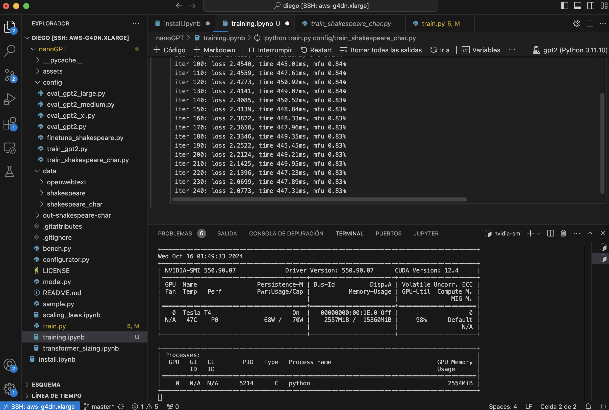

# nanoGPT Training on AWS

This repository provides code and setup instructions for training a small GPT-2 transformer model using nanoGPT on AWS infrastructure with PyTorch. The setup is optimized for GPUs like the Tesla T4.

## Features

- Small-scale GPT-2 implementation using nanoGPT and PyTorch
- Configurable for different GPU architectures (e.g., Tesla T4, A100)
- Optimized for AWS EC2 instances with GPU support



This is a screenshot of VSCode SSH into an AWS EC2 instance while training on a jupyter notebook.

## Setup and Prerequisites

### 1. Clone the Repository

```bash
git clone https://github.com/diego-taquiri/aws-nanoGPT-training.git
cd aws-nanoGPT-training
```

## 2. Install Dependencies

Ensure Python 3.8 or higher is installed. Install the required packages:

```bash
mamba create -n gpt2 python=3.12
pip install torch numpy transformers datasets tiktoken wandb tqdm
```

## 3. AWS Setup

To run training on AWS:

- Launch an EC2 instance with a GPU (e.g., `g4dn.xlarge` with Tesla T4 GPU)
- Use an AWS Deep Learning AMI with PyTorch pre-installed.

## 4. Run the Training Script

After setting up your AWS instance and installing dependencies, run the training script:

```bash
python data/shakespeare_char/prepare.py
python train.py config/train_shakespeare_char.py
```
## 5. Customizing Model Configuration

You can adjust model hyperparameters in `train.py` or via command-line arguments:

- **Data Type**: Set to `float16` for Tesla T4 compatibility:

  ```python
  dtype = 'float16'  # Use FP16 as Tesla T4 does not support BFloat16

- **Disable Compilation**: Disable `torch.compile()` for T4 compatibility:

  ```python
  compile = False  # Disable PyTorch compile for compatibility with T4
- **Other Hyperparameters**: Adjust `n_layer`, `n_head`, `n_embd`, `learning_rate`, etc., to suit your needs.

## Acknowledgements

- [nanoGPT by Andrej Karpathy](https://github.com/karpathy/nanoGPT)

## License

This project is licensed under the MIT License.
